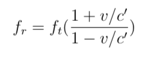
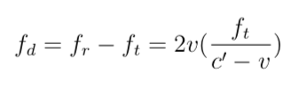
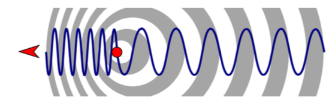
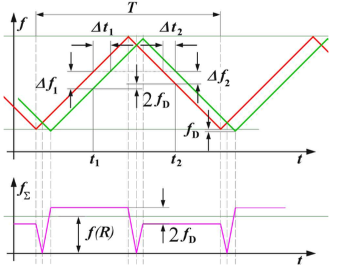
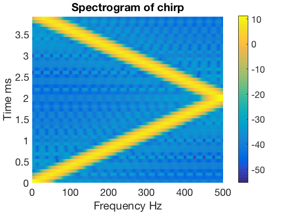
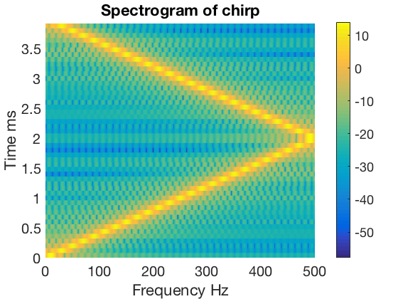
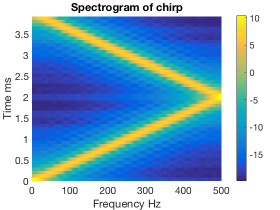

# SpectralEstimationFMCW
Application of Non-Parametric Spectral Estimation techniques on FMCW Signals

----

- Obiettivo: ricostruire in un dominio tempo-frequenza il segnale proveniente da un radar FMCW (Frequency-Modulated Continuous-Wave)
- Tecnica: metodi non parametrici
- Analisi di segnale chirp per valutare la bontà dei metodi

I metodi implementati sono in linguaggio **Matlab** e prevedono funzioni che calcolano il *periodogramma*, il *periodogramma modificato*, il *periodogramma di Welch-Bartlet* e il *periodogramma di Blackman-Tukey*. I risultati vengono valutati con la stampa a video dei grafici ricostruiti ponendo attenzione alla risoluzione di questi.

## Radar

Il funzionamento di un radar è basato sulla trasmissione di un segnale e sulla misura del ritardo che impiega per ritornare dopo essere stato riflesso da un oggetto (bersaglio), tale ritardo diviso per due e moltiplicato per la velocità della luce dà una stima della distanza dell’oggetto.
Se si usa un impulso non modulato, la risoluzione, cioè la capacità di discriminare due oggetti ad una certa distanza tra loro, è legata alla durata dell’impulso trasmesso. Viceversa, se si utilizzano particolari modulazioni, come ad esempio la modulazione lineare di frequenza, è possibile, tramite opportune elaborazioni del segnale, ottenere risoluzioni migliori. La risoluzione dipende infatti dalla banda (B) del segnale e non dalla sua durata, ed è pari circa ad 1/B.
Esistono due tipi di radar continuos-wave: *unmodulated continuous-wave* e *modulated continuous-wave*.

## Unmodulated continuous-wave

In questo tipo di radar si invia un segnale sinusoidale continuo ad una certa frequenza con l’idea che lo stesso segnale rimbalzando su un oggetto, possa subire degli slittamenti in frequenza dovuti all’effetto **Doppler** generato dall’oggetto in movimento. Con questo tipo di radar non c’è modo di determinare la distanza dell’oggetto infatti è usato in sport come golf, tennis, baseball e corse automobilistiche.
La variazione in frequenza dovuta al Doppler dipende dalla velocità *c’* della luce nell’aria (*c’* poichè è leggermente più lenta che nel vuoto) e da *v* la velocità dell’oggetto target:

Lo shift sarà quindi:

|  | 
|:--:| 
| *Variazione della lunghezza d’onda causata dal movimento dell’oggetto target* |

## Modulated continuous-wave

Con questo tipo di radar, anche detto Frequency-modulated continuous-wave radar (FM-CW), è possibile rilevare anche la distanza degli oggetti, migliorando l’affidabilità delle misurazioni ed è indispensabile quando è presente più di un oggetto che riflette il segnale in arrivo dall’antenna del radar. Questo tipo di radar è spesso usato come altimetro per misurare l’altezza esatta durante gli atterraggi aerei, o nei sensori di prossimità.

In questi sistemi il segnale trasmesso è un’onda con frequenza variabile e può seguire vari modelli:

- *Sawtooth wave*, con forma a dente di sega
- *Triangle wave*, con forma triangolare
- *Square wave*, con forma quadrata

In questo progetto è stato usato il modello *Triangle*, in cui si susseguono segnali ”chirp” in salita e discesa. Il termine chirp deriva dall’inglese ed indica un suono corto e acuto, come quello emesso da un insetto o da un uccello.

|  | 
|:--:| 
| *Chirp triangolari trasmessi e ricevuti* |

Il chirp consiste di due rampe con pendenza opposta, entrambe di durata *T/2*. Il segnale ricevuto è ritardato del tempo che il segnale ha impiegato per raggiungere l’oggetto e tornare all’antenna radar. Inoltre il chirp ricevuto ha subito uno slittamento in frequenza pari a f_D.

## Segnale sintetico

Il segnale sintetico su cui abbiamo testato i metodi di stima spettrale sono appunto i chirp, un tipo di segnale di fondamentale importanza nell’utilizzo di sistemi radar.
Considerando una rampa con frequenza lineare crescente che parte da una frequenza portante *fc* ed arriva ad *fc + B*, allora la frequenza al tempo t può essere calcolata come:

dove T è la durata della rampa. La fase corrispondente è l’integrale dell’equazione precedente rispetto a *t*.

Per calcolarne lo spettrogramma, il segnale è stato diviso in finestre di lunghezza k e su ogni finestra è stato applicato uno dei metodi da noi sviluppati per il calcolo del periodogramma. I periodogrammi implilati lungo l’asse temporale rappresentano lo spettrogramma del segnale.
Di seguito vengono mostrati i plot de- gli spettrogrammi ottenuti con le diverse tecniche e parametri calcolati su un chirp di durata 4 ms campionato a 1000 Hz che raggiunge il picco massimo di 500 Hz a 2 ms.

|  | 
|:--:| 
| *Spettrogramma di un chirp con k=80, utilizzando il periodogramma welch-bartlett con finestratura di hamming a 40 campioni e overlap 50%* |

|  | 
|:--:| 
| *Spettrogramma di un chirp con k=80, utilizzando il periodogramma classico* |

|  | 
|:--:| 
| *Spettrogramma di un chirp con k=80, utilizzando il periodogramma blackman-tuckey con finestratura di bartlett a 25 campioni* |

